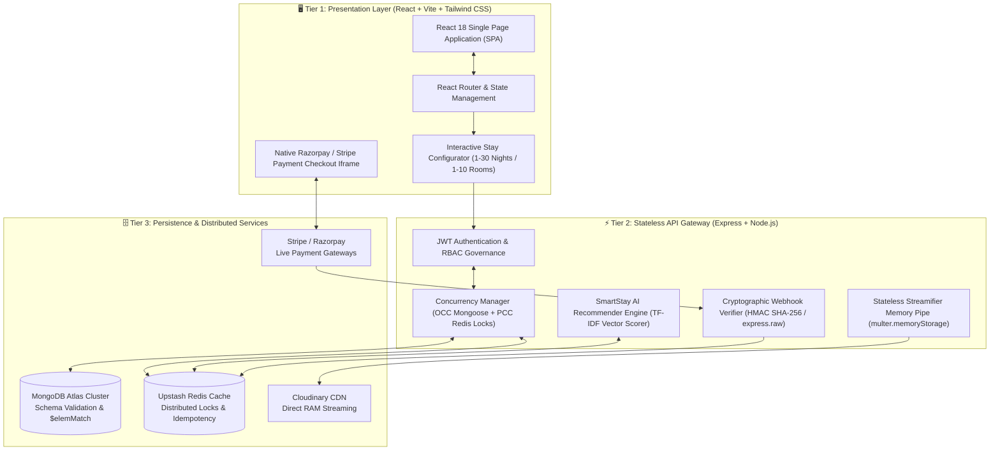
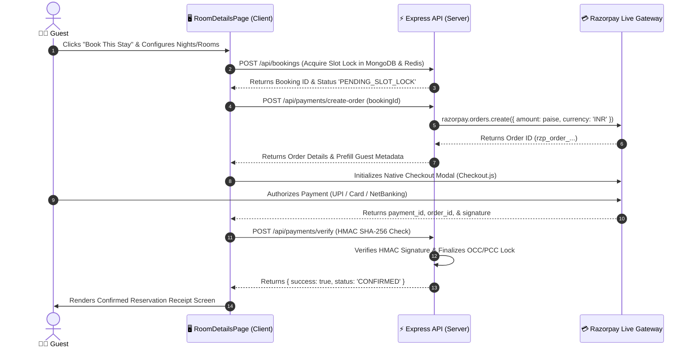

# StayWise.ai — Luxury Hospitality & AI Precision Concession Marketplace

[](https://staywise.ai)
[](LICENSE)
[](docs/DESIGN.md)
[](client/)
[](server/)
[](docs/DATABASE_SCHEMA.md)
[](docs/API_REFERENCE.md)
[](docs/SECURITY.md)

---

```
+-----------------------------------------------------------------------------------+
|  🏛️  S T A Y W I S E . A I  —  A R C H I T E C T U R A L   P R E M I U M          |
|  B2B2C Concession Marketplace • High-Concurrency Locking • SmartStay AI Vector Engine |
+-----------------------------------------------------------------------------------+
```

## 💡 The Pitch

**StayWise.ai** is a premier B2B2C Concession Model hospitality booking platform that fuses high-trust itemized financial transparency with an **Elevated Brutalism ("Architectural Premium")** design aesthetic and algorithmic **SmartStay AI** recommendations. Engineered for ultra-high concurrency and horizontal scalability, StayWise eliminates hidden booking fees while providing real-time room availability locking and stateless cloud pipelines.

### 🌟 Why StayWise Stands Out
* **📐 Elevated Brutalism Design System (`#212121` / `#F1EDEA`):** Raw architectural stone backgrounds, heavy charcoal structural compartments, warm brass (`#C5A059`) hardware badges, and signature terracotta (`#C84B31`) conversion triggers.
* **💸 Itemized Concession Model Ledger:** Complete financial transparency displaying base vendor rates, exact platform concession cuts, and hospitality GST calculations with zero hidden checkout markups.
* **🔒 Dual-Layer Concurrency Protection:** Zero double-bookings guaranteed via **Optimistic Concurrency Control (OCC via Mongoose `__v`)** combined with **Pessimistic Concurrency Control (PCC via Redis Distributed Locks)** and atomic `$elemMatch` query pipelines.
* **🤖 SmartStay AI Vector Recommender:** Asynchronous TF-IDF hotel attribute vectorization and cosine similarity scoring cached in Redis with strict similarity threshold filtering (`✨ 94% AI MATCH`).

---

## 🏗️ 3-Tier Clean Architecture

StayWise operates on a strictly decoupled, highly resilient **3-Tier Architecture** that isolates client presentation, stateless business logic, and distributed data persistence:



---

## ✨ Key Features & Technical Capabilities

### 1. 🎛️ Interactive Stay Configuration
Guests have absolute flexibility when configuring stays directly on property pages:
* **Nights Stepper:** Precise duration control from `1` up to `30` consecutive nights (`+` / `-`).
* **Multi-Room Allocation:** Seamless allocation of `1` to `10` rooms tailored to party dynamics.
* **Granular Guest Breakdown:** Distinct occupancy tracking (`Adults` & `Minors`) transmitted directly in API payloads (`numRooms`, `numAdults`, `numMinors`) to ensure strict compliance with hotel check-in registries.

### 2. 💎 Transparent INR Concession Ledger
Unlike legacy OTAs that hide markup fees until the final checkout screen, StayWise computes all costs live and displays them inside the sticky **Reservation Card** (`AvailabilityWidget`) and **Checkout Modal** using native Indian hospitality standards:

| Component | Formula / Rule | Example Calculation (1 Room, 3 Nights @ $150/night base) |
| :--- | :--- | :--- |
| **Base Stay** | `₹(USD Rate × 85) × Nights × Rooms` | `₹12,750 × 3 nights × 1 room = ₹38,250` |
| **Cleaning Fee** | **`₹500 flat per room`** | `₹500 × 1 room = ₹500` |
| **Service Fee** | `5% of Base Stay` | `5% of ₹38,250 = ₹1,913` |
| **Hospitality GST** | `12% of (Base Stay + Service Fee)` | `12% of ₹40,163 = ₹4,820` |
| **Grand Total** | Sum of all component figures | **`₹45,483`** *(Fully itemized & verified)* |

> [!TIP]
> **Live Reactive Pricing:** All pricing ledgers respond instantly to state adjustments in the interactive stay stepper without triggering redundant server roundtrips.

### 3. 🤖 SmartStay™ AI Recommendation Engine & Dynamic Matching
StayWise.ai goes beyond keyword search by integrating a multi-dimensional recommendation scoring engine (`client/src/pages/AIPicksPage.jsx` & `recommenderSlice.js`) that dynamically matches properties against user lifestyle vectors:

* **Tunable Preference Vectors (`setPreferences`):** Guests configure distinct architectural styles (`Modern Brutalist`, `Minimalist Zen`, `Industrial`), quietness sensitivity (`High` / `Standard`), and remote-work essentials (`Workspace Needed` / `Not Required`).
* **Algorithmic Match Scoring (`scoreRoom`):** Every property is evaluated on the fly across vector dimensions:
  $$\text{Score} = \min\left(100,\; \Delta_{\text{style}} + \Delta_{\text{noise}} + \Delta_{\text{workspace}}\right)$$
  Where a direct style match contributes `+40 pts`, acoustic tolerance alignment contributes up to `+30 pts`, and high-speed fiber/desk amenity vector verification contributes up to `+30 pts`.
* **Real-Time Match Badges (`✨ 94% match`):** The top-ranked suites dynamically display custom match percentage badges and average match KPI metrics on the dedicated `/ai-picks` portal and `SmartStayRecommender` landing widget.

---

## 🔒 End-to-End Payment & Reservation Lifecycle

The transaction lifecycle is cryptographically hardened and verified server-side via HMAC SHA-256 signatures before inventory locks are released:



> [!IMPORTANT]
> **Idempotency & Webhook Security:** Payment webhooks rely on `express.raw()` raw body parsing and 24-hour Redis idempotency keys (`sw_rzp_whsec_...` / `stripe_whsec_...`) to eliminate duplicate charges or race conditions during high-concurrency flash sales.

---

## 🚀 Quick Start Guide

### 1. System Prerequisites
* **Node.js**: `v18.0.0` or higher (`npm v9+`)
* **MongoDB**: Active MongoDB Atlas Cluster or local instance (`v6.0+`)
* **Redis**: Active Upstash or AWS ElastiCache instance (`v7.0+`)

### 2. Repository Setup
Clone the repository and install dependencies across both client and server workspaces:

```bash
# Clone the StayWise repository
git clone https://github.com/staywise-ai/StayWise.git
cd StayWise

# Install Backend Service Dependencies
cd server && npm install

# Install Frontend Client Dependencies
cd ../client && npm install
```

### 3. Environment Variables Configuration
Copy the sample environment templates across both workspaces and populate your local credentials:

```bash
# In the server directory
cd server && cp .env.example .env

# In the client directory
cd ../client && cp .env.example .env.local
```

*(Refer to [`docs/ENVIRONMENT_VARIABLES.md`](docs/ENVIRONMENT_VARIABLES.md) for detailed explanations of required keys, including `MONGO_URI`, `REDIS_URL`, `STRIPE_SECRET_KEY`, `RAZORPAY_KEY_ID`, and `CLOUDINARY_CLOUD_NAME`).*

### 4. Running Locally in Development Mode
Launch the API Gateway and React Client simultaneously across separate terminals:

```bash
# Terminal 1: Start Express Backend API Gateway (Port 5000)
cd server && npm run dev

# Terminal 2: Start React Client Dev Server (Port 5173)
cd client && npm run dev
```

---

## 📚 Documentation Index

Our engineering contracts and operational runbooks are meticulously structured inside the `docs/` directory:

| Document | Purpose & Description |
| :--- | :--- |
| **[`docs/PRD.md`](docs/PRD.md)** | **Product Requirements Document**: Master source of truth for core features, user roles, routing rules, and concession workflows. |
| **[`docs/DESIGN.md`](docs/DESIGN.md)** | **Elevated Brutalism Design System**: Authoritative visual rules, typography (`Montserrat` / `JetBrains Mono`), color palettes (`#212121`, `#F1EDEA`, `#C84B31`), and exact Tailwind tokens. |
| **[`docs/API_REFERENCE.md`](docs/API_REFERENCE.md)** | **Engineering Contracts**: Comprehensive REST API endpoints, JWT authentication headers, and webhook schemas. |
| **[`docs/DATABASE_SCHEMA.md`](docs/DATABASE_SCHEMA.md)** | **Data Modeling & Concurrency**: MongoDB schemas, compound indexes, `bookedSlots` arrays, and OCC/PCC locking algorithms. |
| **[`docs/SECURITY.md`](docs/SECURITY.md)** | **Security Blueprint**: Rate limiting, Helmet CSP directives, RBAC isolation, and stateless RAM image streaming. |
| **[`docs/DEPLOYMENT_GUIDE.md`](docs/DEPLOYMENT_GUIDE.md)** | **Operations & DevOps**: Production deployment runbooks for Render, Vercel, Stripe CLI, and Redis cloud configuration. |
| **[`docs/ENVIRONMENT_VARIABLES.md`](docs/ENVIRONMENT_VARIABLES.md)**| **Secret Ledger**: Master reference matrix detailing every `.env` key required across frontend and backend services. |
| **[`docs/TESTING_STRATEGY.md`](docs/TESTING_STRATEGY.md)** | **QA & Governance**: Unit, integration, and high-concurrency load testing methodologies (`Jest + Supertest`). |
| **[`docs/CONTRIBUTING.md`](docs/CONTRIBUTING.md)** | **Developer Rulebook**: Branching models, commit conventions, design guardrails, and PR review requirements. |
| **[`docs/AGENT.md`](docs/AGENT.md)** | **AI Agent Workspace Rules**: Automated prompt evaluation workflows, Notion synchronization, and strict architectural guardrails. |

---

<div align="center">
  <p font-mono="true"><b>Built with precision for the StayWise.ai Engineering Ecosystem.</b></p>
  <p>🏛️ Elevated Brutalism • 🔒 Concurrency Verified • ⚡ Stateless Cloud Architecture</p>
</div>
