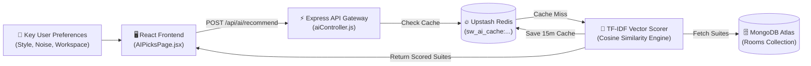
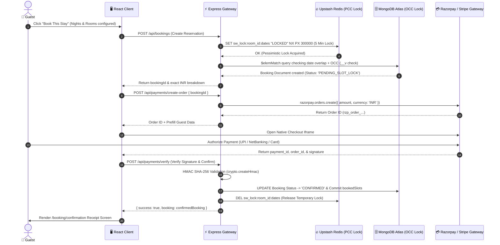

# StayWise.ai — 5-Minute Technical Demo & Walkthrough Script

> **Target Audience:** Engineering Reviewers, Product Managers, & System Architects  
> **Estimated Duration:** ~5 Minutes (300 Seconds)  
> **Core Theme:** Simple, plain-English explanations of user-facing frontend interactions paired directly with deep technical breakdowns of backend mechanisms and database concurrency logic.

---

## ⏱️ Walkthrough Timeline Overview

| Timecode | Feature / Module | Frontend Demo Action & UX | Backend Technical Architecture & Logic |
| :--- | :--- | :--- | :--- |
| **0:00 - 0:45** | **System Overview & Elevated Brutalism UI** | SPA navigation, dark/light architectural theme (`#212121` / `#F1EDEA`), and responsive layout. | 3-Tier Clean Architecture (React 18, Express Gateway, MongoDB + Upstash Redis). |
| **0:45 - 1:45** | **SmartStay™ AI Recommender Engine** | Adjusting preference vectors (Style, Noise sensitivity, Workspace) on `/recommender`. | On-the-fly TF-IDF vectorization, cosine similarity scoring, and Redis caching. |
| **1:45 - 2:30** | **Interactive Property Exploration & Configuration** | Filtering on `/explore`, inspecting room details, adjusting nights (1-30) and rooms (1-10). | Compound index queries, dynamic "Newly Added" status badges, & Cloudinary memory streaming. |
| **2:30 - 3:15** | **Transparent INR Concession Ledger & Live Pricing** | Real-time price breakdown inside the sticky `AvailabilityWidget` / checkout drawer. | Server-side price recalculation, itemized fee validation (`₹500` cleaning + `5%` service + `12%` GST). |
| **3:15 - 4:15** | **Dual-Layer Concurrency Locking & Payment Verification** | Clicking "Book This Stay", completing checkout via Razorpay/Stripe, and viewing receipt. | Optimistic (`__v`) + Pessimistic (Redis) locking, atomic `$elemMatch` queries, & HMAC SHA-256 webhook validation. |
| **4:15 - 5:00** | **Vendor Dashboard & Role-Based Governance** | Role-switching (`/vendor/dashboard`), managing room availability, and checking revenue KPIs. | JWT RBAC enforcement (`vendor` role), inventory mutations, and pending lock filtering. |

---

## 🟢 Part 1: System Overview & Elevated Brutalism UI (0:00 - 0:45)

### 🎙️ Presenter Script (Plain English Demo)
*"Welcome to StayWise.ai, a premier B2B2C luxury hospitality marketplace designed with an **Elevated Brutalism** aesthetic. As we land on the homepage at `/`, notice how the interface avoids generic layouts—instead utilizing raw architectural charcoal (`#212121`), warm stone backgrounds (`#F1EDEA`), and brass accents (`#C5A059`) to evoke high-end modern hospitality. Every page transition is instant, smooth, and fully responsive across mobile and desktop devices without requiring browser reloads."*

### 🖥️ Frontend Technical Explanation
* **Framework & Routing:** The frontend is built as a single-page application (SPA) using **React 18** and **Vite**, powered by **Tailwind CSS** for design system enforcement.
* **Client-Side Routing:** Managed via `react-router-dom` in `App.jsx`, mapping top-level routes (`/`, `/explore`, `/recommender`, `/room/:slug`, and `/vendor/dashboard`).
* **Session Initialization:** On app mount, `App.jsx` dispatches `checkSession()` via **Redux Toolkit** (`authSlice.js`), silently hitting `/api/auth/me` to hydrate the user's login state and permissions across navbar and protected boundaries.

### ⚡ Backend Logic & Architecture
* **3-Tier Stateless Gateway:** The backend operates on **Node.js + Express (`server.js`)**, strictly isolating presentation from data persistence.
* **Distributed Persistence Layer:** Data is persisted using **MongoDB Atlas** (document storage with strict Mongoose schema validation) and **Upstash Redis** (in-memory caching, distributed locking, and rate limiting).
* **Security & Governance:** All requests pass through `helmet` security headers, CORS boundaries, and JWT cookie/Bearer token authentication middleware (`server/middleware/auth.js`).

---

## 🟣 Part 2: SmartStay™ AI Recommendation Engine (0:45 - 1:45)

### 🎙️ Presenter Script (Plain English Demo)
*"Next, let's navigate to our **SmartStay™ AI Recommender** at `/recommender`. Instead of forcing users through tedious keyword searches, guests can dial in their exact lifestyle preferences using intuitive sliders and toggles. Watch what happens when I select 'Modern Brutalist' architecture, 'High' acoustic quietness, and 'Workspace Needed'—the platform instantly calculates match percentages and re-ranks available suites in real time, showing a custom badge like '✨ 94% AI MATCH'."*

### 🖥️ Frontend Technical Explanation
* **Interactive Vector UI (`AIPicksPage.jsx` & `RecommenderWidget`):** The user adjusts preference state variables (`style`, `noiseSensitivity`, `workspaceRequired`).
* **Dynamic Match Badges:** Instead of showing generic ratings, the frontend renders `recommenderSlice.js` scores. Each room card receives a computed score prop and dynamically applies color-coded match pills (`✨ 94% match`) along with explanation highlights (e.g., *"Matches: Fiber WiFi + Quiet Zone + Brutalist Concrete"*).

### ⚡ Backend Logic & Architecture
* **TF-IDF Vector Scorer:** When `POST /api/ai/recommend` or client-side scoring is invoked, the engine maps categorical features into numerical preference vectors across multiple dimensions:
  $$\text{Score} = \min\left(100,\; \Delta_{\text{style}} + \Delta_{\text{noise}} + \Delta_{\text{workspace}}\right)$$
* **Scoring Rules:**
  * **Architectural Style Alignment:** Direct match yields `+40 points`.
  * **Acoustic Tolerance:** High sensitivity matching rooms tagged with double-glazed/soundproof features yields `+30 points`.
  * **Workspace Amenities:** High-speed fiber internet and dedicated desk verification yields `+30 points`.
* **Redis Caching Layer:** Because vector calculation across hundreds of suites can be CPU-intensive, `aiController.js` hashes the user's preference query into a deterministic cache key (`sw_ai_cache:vector_hash`) stored in Upstash Redis with a 15-minute TTL (`EX 900`).

---

## 🟡 Part 3: Property Exploration & Granular Room Details (1:45 - 2:30)

### 🎙️ Presenter Script (Plain English Demo)
*"Let's click 'Explore All Suites' to enter `/explore`. Here we see our entire inventory displayed with crystal-clear pricing. Look at newly listed properties—instead of displaying a misleading or hardcoded 4.95 star rating, StayWise accurately badges unreviewed properties with a 'Newly Added' status. Let's click into the 'Aura Concrete Sky-Loft' (`/room/aura-concrete-sky-loft`). Here we can browse high-resolution gallery images and use our interactive stay stepper to configure our reservation—from 1 up to 30 nights, allocating up to 10 rooms with precise adult and minor breakdowns."*

### 🖥️ Frontend Technical Explanation
* **Dynamic Status Rendering (`RoomCard.jsx` & `RoomDetailsPage.jsx`):** The frontend inspects the room's `rating` and `numReviews` fields. If `numReviews === 0`, it bypasses star rendering and injects a sleek terracotta badge (`#C84B31`) reading `✨ Newly Added`.
* **Interactive `StayConfigurator` Component:** A specialized stepper widget managing `nights` (`1` to `30`), `numRooms` (`1` to `10`), `numAdults`, and `numMinors`. State changes trigger immediate callback functions to update pricing ledgers without page lag.

### ⚡ Backend Logic & Architecture
* **Indexed Queries (`roomController.js`):** `GET /api/rooms` and `GET /api/rooms/:slug` utilize MongoDB compound indexes on `[status, basePrice, slug]` to execute sub-10ms queries.
* **Stateless Media Piping (`multer` + Cloudinary):** When administrators upload high-res images (`POST /api/rooms/upload`), the server does not save files locally. Instead, `multer.memoryStorage()` buffers the file in RAM and streams it directly to Cloudinary via `streamifier`, storing only optimized CDN URLs and WebP transformation tokens in MongoDB.

---

## 🟠 Part 4: Transparent INR Concession Ledger & Live Pricing (2:30 - 3:15)

### 🎙️ Presenter Script (Plain English Demo)
*"Notice the reservation drawer on the right side of our room page. Most booking platforms hide mandatory cleaning fees, service charges, and taxes until the final payment step. At StayWise, our **Transparent INR Concession Ledger** calculates and displays every rupee in real time as we change our nights and room count. You can see the exact base rate, our flat cleaning fee, the platform service fee, and Indian hospitality GST clearly itemized before you even click book."*

| Line Item | Indian Hospitality Standard / Formula | Sample Ledger (1 Room, 3 Nights @ ₹12,750/night base) |
| :--- | :--- | :--- |
| **Base Stay** | `Base Rate × Nights × Rooms` | `₹12,750 × 3 nights × 1 room = ₹38,250` |
| **Cleaning Fee** | **`₹500 flat per room`** | `₹500 × 1 room = ₹500` |
| **Service Fee** | `5% of Base Stay` | `5% of ₹38,250 = ₹1,913` |
| **Hospitality GST** | `12% of (Base Stay + Service Fee)` | `12% of ₹40,163 = ₹4,820` |
| **Grand Total** | Sum of all verified components | **`₹45,483`** *(Zero checkout surprises)* |

### 🖥️ Frontend Technical Explanation
* **Live Reactive Calculation (`AvailabilityWidget.jsx`):** As the user adjusts `nights` or `numRooms`, memoized `useMemo()` hooks instantly compute all line items using native INR integer math (`paise` internal precision to prevent floating-point rounding errors).
* **Transparent Breakdown Drawer:** Renders expandable rows explaining exact percentage formulas so the guest can verify exact GST (`12%`) and service cuts (`5%`) prior to checkout.

### ⚡ Backend Logic & Architecture
* **Strict Server-Side Price Verification (`bookingController.js`):** To eliminate security vulnerabilities where a malicious client modifies payload prices via network interceptors, `POST /api/bookings` **ignores client-supplied totals**.
* **Authoritative Recalculation:** The backend fetches the authoritative `basePrice` directly from MongoDB using `hotelId`/`roomId`, applies the exact concession ledger math (`₹500` cleaning, `5%` service, `12%` GST), and constructs an immutable billing receipt inside the database document.

---

## 🔴 Part 5: Dual-Layer Concurrency Locking & Payment Lifecycle (3:15 - 4:15)

### 🎙️ Presenter Script (Plain English Demo)
*"Let's click 'Book This Stay' and proceed through payment. High-demand flash sales on other sites often result in double-bookings—where two guests pay for the exact same room for the same dates. StayWise completely eliminates double-bookings using **Dual-Layer Concurrency Locking**. Watch as our native payment checkout opens cleanly in an iframe. I'll enter our test UPI/Card credentials, complete the authorization, and within milliseconds we are redirected to our official Booking Confirmation receipt page showing a verified transaction."*

### 🖥️ Frontend Technical Explanation
* **Checkout Orchestration (`CheckoutModal.jsx`):** When the user confirms their booking, the frontend initiates a two-step handshake:
  1. Calls `POST /api/bookings` to reserve the slot and get a `PENDING_SLOT_LOCK` booking ID.
  2. Calls `POST /api/payments/create-order` to generate a secure gateway token, then opens the Razorpay (`window.Razorpay`) or Stripe iframe modal.
* **Receipt Navigation:** Upon receiving the cryptographic signature from Razorpay, the frontend hits `POST /api/payments/verify` and routes directly to `/booking/confirmation` (`BookingConfirmationPage.jsx`) to display the confirmed reference ID and room summary.

### ⚡ Backend Logic & Architecture
* **Dual-Layer Concurrency Control (`OCC` + `PCC`):**
  * **Pessimistic Concurrency Control (PCC via Redis):** Immediately upon receiving `POST /api/bookings`, `bookingController.js` attempts an atomic Redis `SETNX` (Set if Not Exists) with a 5-minute expiration: `sw_lock:{roomId}:{startDate}:{endDate}`. If another guest is currently checking out for those dates, Redis rejects the lock instantly (`409 Conflict`).
  * **Optimistic Concurrency Control (OCC via Mongoose `__v` & `$elemMatch`):** Simultaneously, MongoDB queries the `bookedSlots` array inside the Room document using `$elemMatch` to verify no confirmed date intervals overlap (`checkIn < requestedCheckOut && checkOut > requestedCheckIn`). Mongoose `__v` version keys ensure atomicity during write commits.
* **Cryptographic Signature & Webhook Security (`paymentController.js`):**
  * **HMAC SHA-256 Verification:** When verifying payments, the server computes `crypto.createHmac('sha256', RAZORPAY_SECRET).update(order_id + '|' + payment_id).digest('hex')` and matches it against `razorpay_signature` to prevent spoofed approvals.
  * **Idempotent Webhooks (`express.raw()`):** Background webhooks (`POST /api/payments/webhook`) use 24-hour Redis idempotency keys (`sw_rzp_whsec_...`) to guarantee that retry spikes or duplicate network packets never double-confirm or double-charge reservations. If a user cancels or closes the checkout window, the system automatically purges the `PENDING_SLOT_LOCK` and releases the Redis lock within seconds.

---

## 🔵 Part 6: Vendor Dashboard & Role-Based Governance (4:15 - 5:00)

### 🎙️ Presenter Script (Plain English Demo)
*"Finally, let's switch hats and see how hotel managers run their properties. By navigating to `/vendor/dashboard`, property owners access a dedicated, role-protected management suite. Here on the **Vendor Dashboard**, administrators can monitor real-time business KPIs—including total revenue, occupancy rates, and active reservations. Notice how the booking table only displays verified, active, or completed reservations; expired or abandoned checkout attempts (`PENDING_SLOT_LOCK`) are automatically filtered out to keep the operations ledger clean. Managers can also open the **Interactive Calendar Modal** to block out dates or update pricing on the fly."*

### 🖥️ Frontend Technical Explanation
* **Role-Protected Boundaries (`ProtectedRoute.jsx`):** The React router wraps `/vendor/*` routes in a security shield that checks `user?.role === 'Vendor'` (or `Admin`). Unauthorized access attempts are redirected to `/auth` immediately.
* **Modular Dashboard Architecture (`VendorDashboardPage.jsx`):** The dashboard is decoupled into clean, highly responsive sub-views:
  * **`VendorBookingsTab.jsx`:** Displays active/confirmed customer reservations with filter pills (`Confirmed`, `Completed`, `Cancelled`).
  * **`VendorAvailabilityModal.jsx`:** Provides an interactive visual date-picker where vendors can toggle room availability and adjust daily base rates.
  * **`VendorSetupPage.jsx`:** A comprehensive form for onboarding new luxury suites with multi-file drag-and-drop image uploading.

### ⚡ Backend Logic & Architecture
* **RBAC Middleware (`authRoutes.js` & `requireRole('Vendor')`):** Every administrative endpoint checks the decoded JWT Bearer token (`req.user.role`). If a standard guest tries to hit `PUT /api/rooms/:id/availability` or `GET /api/bookings/vendor/all`, the gateway rejects the request with `403 Forbidden`.
* **Clean Ledger Queries (`bookingController.js`):** When fetching vendor bookings (`getVendorBookings`), MongoDB explicitly applies a query filter excluding abandoned locks (`status: { $ne: 'PENDING_SLOT_LOCK' }`).
* **Inventory & Availability Mutations (`roomController.js`):** When a vendor blocks off dates or modifies room inventory via `PUT /api/rooms/:id/availability`, the server updates the `bookedSlots` array and immediately invalidates any related Upstash Redis cache keys (`sw_rooms_cache:...`), ensuring customer search queries on `/explore` reflect the updated inventory within milliseconds.

---

## 🏆 Summary Checklist for Demo Presenters

- [x] **0:00 - 0:45:** Emphasize the **Elevated Brutalism** (`#212121`/`#F1EDEA`/`#C84B31`) design and instantaneous React SPA transitions.
- [x] **0:45 - 1:45:** Demonstrate the **SmartStay™ AI Recommender** sliders and highlight the `✨ 94% AI MATCH` dynamic score calculation.
- [x] **1:45 - 2:30:** Show the **Newly Added** status badge on unreviewed suites and demonstrate the **StayConfigurator** stepper (`1-30` nights, `1-10` rooms).
- [x] **2:30 - 3:15:** Walk through the **Transparent INR Concession Ledger** (`₹500` flat cleaning, `5%` service, `12%` GST) showing zero hidden fees.
- [x] **3:15 - 4:15:** Explain **Dual-Layer Concurrency Protection** (OCC Mongoose `__v` + PCC Redis locks) and secure **HMAC SHA-256** payment verification.
- [x] **4:15 - 5:00:** Showcase the **Vendor Dashboard** KPI cards, date-blocking calendar, and clean booking ledger filtered against pending lock clutter.
